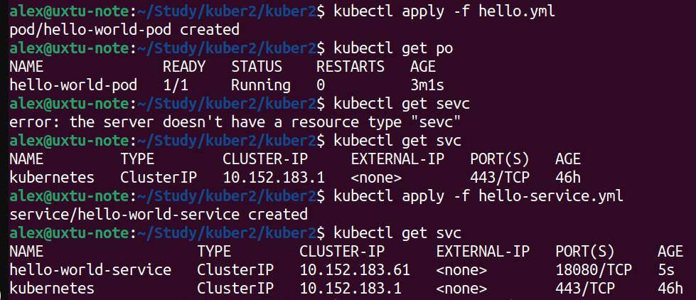
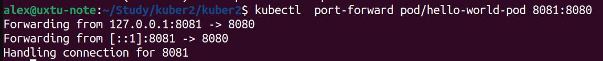
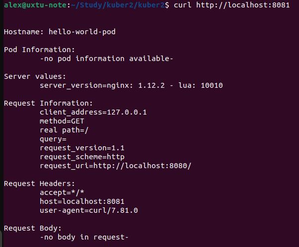

##  Домашнее задание по теме Kubernetes - компоненты ##  

### Задание 1 - Создать Pod ###  
Создал манифест для Pod-а hello.yml (прилагается)  
Запустил Pod  
  
С помощью port-forward сделал Pod доступным  
  
Проверил соединение  
  

### Задание 2 - Создать Service ###  
Создал манифест для Service-а (прилагается)  
Запустил сервис  
