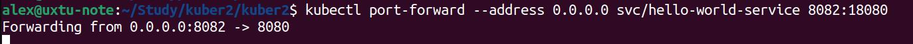
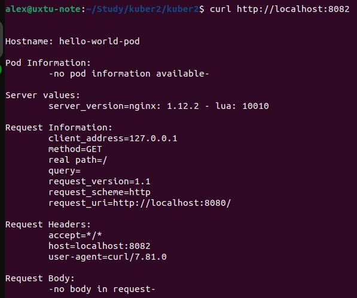

##  Домашнее задание по теме Kubernetes - компоненты ##  

### Задание 1 - Создать Pod ###  
Создал манифест для Pod-а hello.yml (прилагается)  
Запустил Pod  
```
alex@uxtu-note:~/Study/kuber2/kuber2$ kubectl apply -f hello.yml 
pod/hello-world-pod created

```  
  
С помощью port-forward сделал Pod доступным  
```
alex@uxtu-note:~/Study/kuber2/kuber2$ kubectl  port-forward pod/hello-world-pod 8081:8080
Forwarding from 127.0.0.1:8081 -> 8080
Forwarding from [::1]:8081 -> 8080
Handling connection for 8081
```  
  
Проверил соединение  
  

### Задание 2 - Создать Service ###  
Создал манифест для Service-а (прилагается)  
Запустил Service  
```
alex@uxtu-note:~/Study/kuber2/kuber2$ kubectl apply -f hello-service.yml 
service/hello-world-service created
```  
  
С помощью port-forward сделал Service доступным  
  
Проверил соединение  
  

